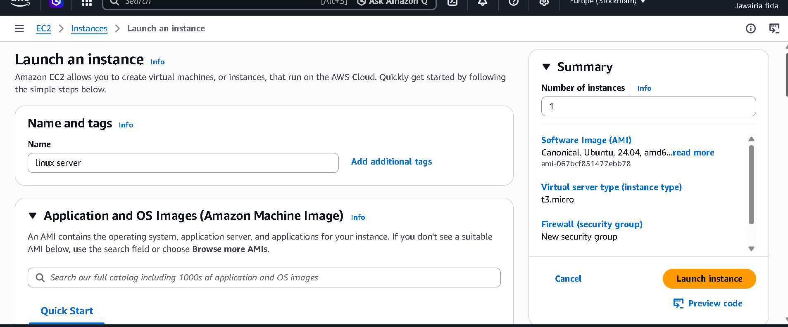
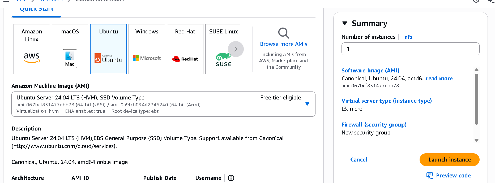
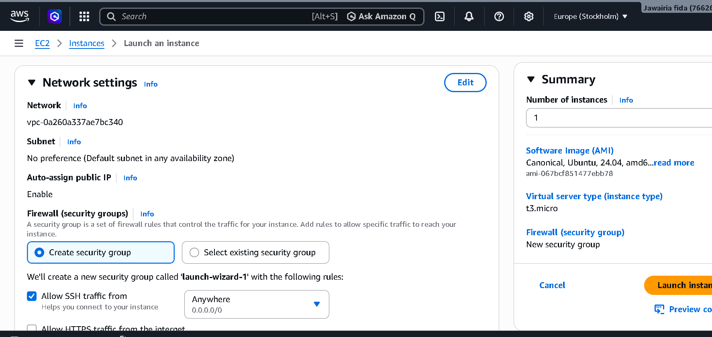
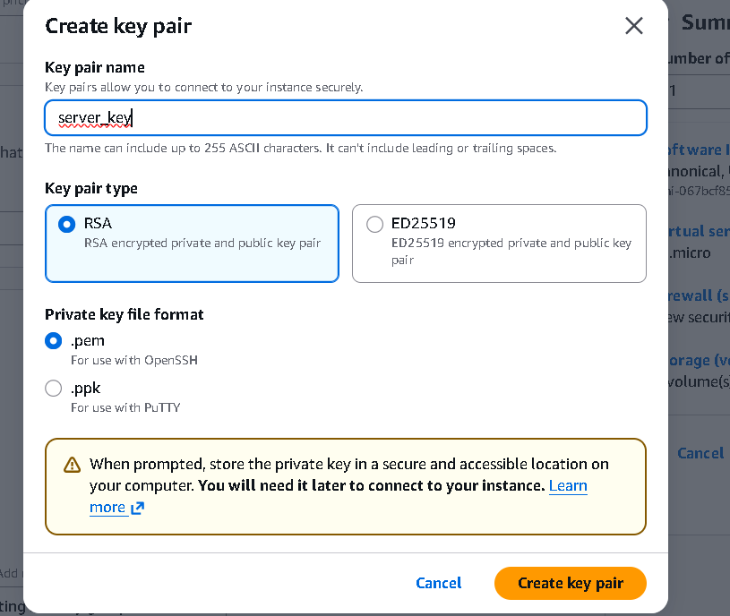
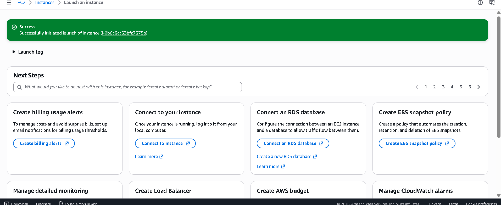
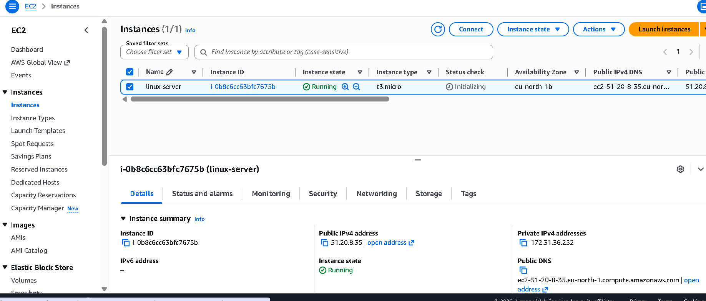
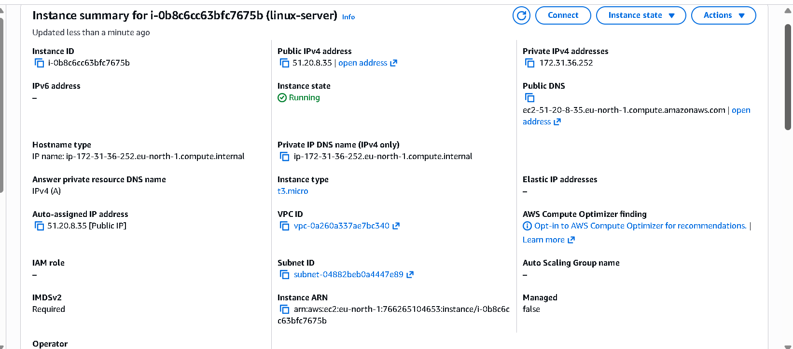
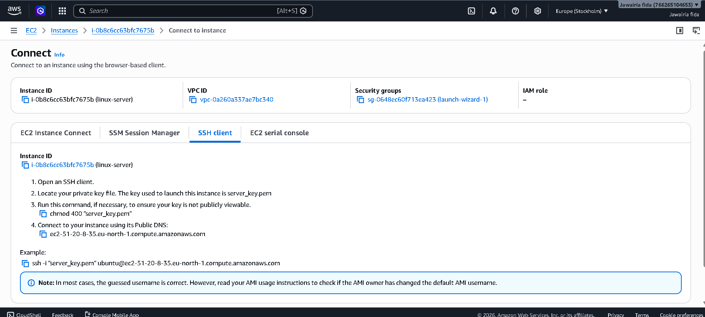
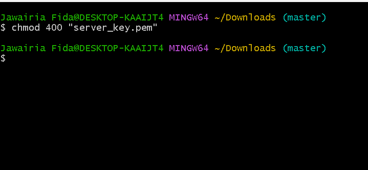
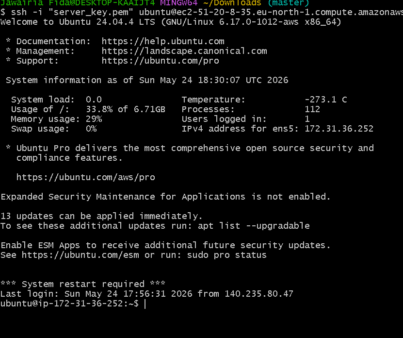

# AWS EC2 Ubuntu Server 🚀

---

## 📌  Project Overview

 This is a beginner cloud project where I launched an Ubuntu 24.04 server on AWS EC2, created a key pair , configured security group and connected to the server using SSH.

---

##  ⚙ Instance Configuration

| Setting | Details|
|---|---|
|OS| Ubuntu 24.04 LTS|
|Instance Type | t3.micro|
| Storage | 8 GB|
| Region | Europe (Stockholm)|
| Key Pair| RSA (.pem)|
| Free Tier|Eligible|

---

## 🛠 Tech Stack

- AWS EC2
- Ubuntu 24.04 LTS
- OpenSSH
- Git Bash
- Security Groups
- VPC

---

## 📋 Setup Steps

1. Log in to AWS Console
2. Go to EC2 and click Launch Instance
3. Name the instance and select Ubuntu 24.04
4. Choose t3.micro (Free Tier eligible)
5. Create a key pair (server_key.pem)
6. Configure Security Group (allow SSH on port 22)
7. Launch the instance
8. Connect using SSH

---

## 🔐 How to Connect

chmod 400 "server_key.pem"
ssh -i "server_key.pem" ubuntu@YOUR-PUBLIC-IP

---

## ⚠ Important Notes

- Never share your .pem key file with anyone
- Always terminate your instance after practice to avoid charges
- SSH is allowed on Port 22 only
- Instance was terminated after practice

---

## 🔮 Future Plans

- Install Nginx web server
- Host a static website
- Setup Docker
- Configure CI/CD pipeline
- Learn Terraform

---

## 😤 Challenges I Faced

- Understanding how key pairs work
- Setting correct permissions on .pem file using chmod 400
- Figuring out the correct SSH command format

---

## 📚 What I Learned

- How to launch a cloud server on AWS
- How SSH authentication works
- How to configure Security Groups
- How key pairs protect server access
- Basic Linux server navigation

---

## 📷 Screenshots

### EC2 Launch Instance

### Ubuntu AMI Selection

### Network & Security Settings

### Key Pair Creation

### Instance Launch Success

### Instance Running

### Instance Summary

### SSH Connection Guide

### chmod Key Permission

### SSH Login Success

---

## 👩‍💻 About Me

Cloud & DevOps beginner learning AWS, Linux and DevOps 
through hands-on projects 🚀

